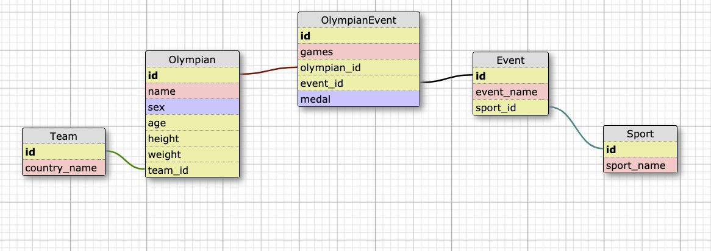

[](https://circleci.com/gh/CSheesley/koroibos)
# README


### Project Description
This is the final solo project for the Backend program at the Turing School of Software and Design. The goal is to treat this like a 48 hour take home [Code Challenge](https://github.com/turingschool/backend-curriculum-site/blob/gh-pages/module4/projects/take_home_challenge/prompts/olympic_spec.md) that one may receive during the interview process. We were given free choice of which language to use, and what we want to highlight when we present our work.

### Local Set-up
`$ bundle install`  
`$ rails db:create`  
`$ rails db:migrate`  
`$ rails olympic_data:import_2016`  

### Key Learnings
48 hour Timed Code Challenge  
Schema Design  
Creating a Rake Task
Importing a CSV file  
Continuous Integration  
ActiveRecord  
ActiveModelSerializers  
API Endpoints  

### Versions
Ruby - 2.4.1  
Rails - 5.2.3  
Bundler - 2.0.2  

### Links
Heroku Link: https://koroibos-2016.herokuapp.com/     
Project Spec: https://github.com/turingschool/backend-curriculum-site/blob/gh-pages/module4/projects/take_home_challenge/prompts/olympic_spec.md

### Endpoint Documentation
All endpoints are preceded by the following url: https://koroibos-2016.herokuapp.com/

---
**GET /api/v1/olympians**  
Returns all olympians, along with their name, age, team, sport, and total medals won.

Required Parameters:
`no required parameters`

Example Request:
`GET https://koroibos-2016.herokuapp.com/api/v1/olympians`
```
Request:
Content-Type: application/json
Accept: application/json
```
```
Response:
status: 200
body:
{
  olympians: [
    {
      name: "Andreea Aanei",
      team: "Romania",
      age: 22,
      sport: "Weightlifting",
      total_medals_won: 0
    },
    {
      name: "Nstor Abad Sanjun",
      team: "Spain",
      age: 23,
      sport: "Gymnastics",
      total_medals_won: 0
    },
    ...
  ]
}
```
---
**GET /api/v1/olympians?age=youngest**  
Returns a list of olympians with the youngest age, along with their name, age, team, sport, and total medals won. In the case that there is only one olympian with the minimum age of all olympians, a list with a single olympian will be returned.

Required Parameters:
`age` - "youngest"

Example Request:
`GET https://koroibos-2016.herokuapp.com/api/v1/olympians?age=youngest`
```
Request:
Content-Type: application/json
Accept: application/json
```
```
Response:
status: 200
body:
{
  olympians: [
    {
      name: "Ana Iulia Dascl",
      team: "Romania",
      age: 13,
      sport: "Swimming",
      total_medals_won: 0
    }
  ]
}
```
---
**GET /api/v1/olympians?age=oldest**  
Returns a list of olympians with the oldest age, along with their name, age, team, sport, and total medals won. In the case that there is only one olympian with the maximum age of all olympians, a list with a single olympian will be returned.

Required Parameters:
`age` - "oldest"

Example Request:
`GET https://koroibos-2016.herokuapp.com/api/v1/olympians?age=oldest`
```
Request:
Content-Type: application/json
Accept: application/json
```
```
Response:
status: 200
body:
{
  olympians: [
    {
      name: "Julie Brougham",
      team: "New Zealand",
      age: 62,
      sport: "Equestrianism",
      total_medals_won: 0
    }
  ]
}
```
---
**GET /api/v1/olympians?age=< n >**  
Returns a list of olympians with the age parameter, along with their name, age, team, sport, and total medals won. In the case that there are no olympians with the that age, an empty list is returned.

Required Parameters:
`age` - an Integer value greater than 0.

Example Request:
`GET https://koroibos-2016.herokuapp.com/api/v1/olympians?age=50`
```
Request:
Content-Type: application/json
Accept: application/json
```
```
Response:
status: 200
body:
{
  olympians: [
    {
      name: "Roger-Yves Bost",
      team: "France",
      age: 50,
      sport: "Equestrianism",
      total_medals_won: 1
    },
    {
      name: "Danilo Caro Guarnieri",
      team: "Colombia",
      age: 50,
      sport: "Shooting",
      total_medals_won: 0
    },
    {
      name: "Dan Anders Hkan Dahlby",
      team: "Sweden",
      age: 50,
      sport: "Shooting",
      total_medals_won: 0
    }
  ]
}
```
---
**GET /api/v1/olympian_stats**  
Returns overall olympian statistics including: total competitors, average weight by gender, and average age for all olympians.

Required Parameters:
`no required parameters`

Example Request:
`GET https://koroibos-2016.herokuapp.com/api/v1/olympian_stats`
```
Request:
Content-Type: application/json
Accept: application/json
```
```
Response:
status: 200
body:
{
  olympian_stats: {
    total_competing_olympians: 2850,
    average_weight: {
      unit: "kg",
      male_olympians: 77.9,
      female_olympians: 61.4
    },
    average_age: 26.4
  }
}
```

### Schema

